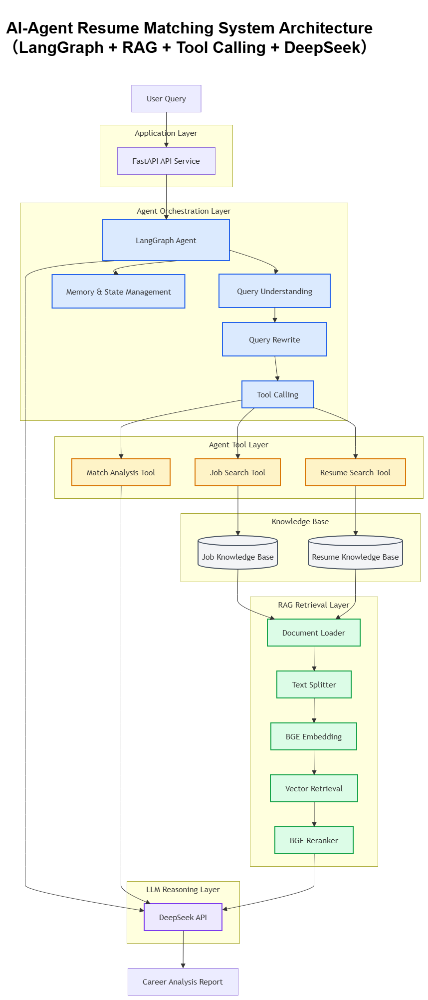

# AI-Agent-Resume-Matching-System

> 基于 LangGraph + RAG + Tool Calling 架构构建的智能岗位匹配 Agent 系统，实现简历理解、岗位检索、能力分析与职业建议生成。

一个面向真实职业分析场景的大模型 Agent 应用项目。

本项目通过 Agent 工作流编排、知识库检索、工具调用以及大模型推理，实现从用户需求理解、信息检索到智能分析报告生成的完整流程。


---

# 🌟 Project Overview

传统岗位匹配通常依赖关键词搜索，难以理解：

- 用户真实技能水平
- 项目经验价值
- 岗位技术要求
- 能力差距

本项目构建一个基于 LLM Agent 的智能岗位匹配系统，通过：

- LangGraph Agent Workflow
- RAG 检索增强生成
- Vector Database
- Tool Calling
- Query Rewrite
- Reranking

实现更加智能的职业分析与岗位匹配。


---

# 🚀 Project Highlights

- ✅ 基于 LangGraph 构建 Agent 工作流
- ✅ 完整实现 RAG Pipeline
- ✅ 支持 Agent Tool Calling
- ✅ 支持 Query Understanding
- ✅ 支持 Query Rewrite 优化检索
- ✅ 构建个人简历知识库
- ✅ 构建岗位信息知识库
- ✅ 使用向量检索 + Reranker 提升匹配效果
- ✅ 模块化工程架构设计


---

# 🏗️ System Architecture





如果图片不可用，可查看：

[Architecture Documentation](docs/architecture.md)


---

# 🔥 Agent Workflow


User Query

|
v

Query Understanding

|
v

Query Rewrite

|
v

LangGraph Agent

|
|
+----------------+
|                |
v                v

Resume Tool Job Search Tool

|                |

Resume DB Job Vector DB

|
v

Retriever

|
v

Reranker

|
v

DeepSeek LLM

|
v

Career Analysis Report


---

# 🧠 Core Features


## 1. LangGraph Agent

基于 LangGraph 实现 Agent 状态管理和任务编排。

Agent 可以根据用户需求：

- 查询个人技能信息
- 查询岗位需求
- 调用不同工具
- 分析能力匹配度
- 生成职业建议


核心能力：

- Agent Workflow
- State Management
- Tool Calling
- Memory Checkpoint


---

# 2. RAG Knowledge System


完整 RAG Pipeline：


Document

↓

Loader

↓

Text Splitter

↓

Embedding

↓

Vector Database

↓

Retriever

↓

Reranker

↓

LLM Generation


实现：

- PDF 文档解析
- 文本切分
- 向量化
- 相似度检索
- Query Rewrite
- Multi Query Retrieval
- Reranking


---

# 3. Query Understanding & Rewrite


用户输入自然语言问题：

例如：


分析我的 Agent 开发能力


系统自动生成适合检索的问题：


Agent开发技能

Agent项目经验

LangGraph项目经验


提升复杂问题下的检索准确率。


---

# 4. Agent Tool Calling


Agent 通过工具完成任务。


## Resume Search Tool

个人知识库检索：

功能：

- 查询个人技能
- 查询项目经验
- 查询技术栈


## Job Search Tool

岗位知识库检索：

功能：

- 获取岗位需求
- 分析技术要求
- 获取岗位方向


## Match Tool

岗位匹配分析：

功能：

- 对比用户能力和岗位需求
- 输出匹配结果
- 给出提升建议


---

# 5. Memory & State Management


基于 LangGraph Checkpointer 实现：

- 多轮对话状态保存
- Agent 状态管理
- Workflow 状态恢复


---

# 🛠️ Technology Stack


| Category | Technology |
|---|---|
| Language | Python |
| Agent Framework | LangGraph |
| LLM Framework | LangChain |
| Vector Database | ChromaDB |
| Embedding Model | BGE Embedding |
| Reranker | BGE Reranker |
| Backend | FastAPI |
| Data Validation | Pydantic |
| LLM API | DeepSeek API |


---

# 📂 Project Structure


AI-Agent-Resume-Matching-System

├── agents
│ └── Agent核心逻辑

├── api
│ └── FastAPI接口

├── chains
│ └── LLM Chain流程

├── tools
│ └── Agent工具

├── retrievers
│ └── 检索模块

├── vectorstores
│ └── Chroma向量数据库

├── embeddings
│ └── Embedding模块

├── rerankers
│ └── Reranker模块

├── memory
│ └── 状态管理

├── loaders
│ └── 文档加载

├── pipelines
│ └── RAG Pipeline

├── prompts
│ └── Prompt模板

├── schemas
│ └── 数据结构

└── main.py


---

# ⚙️ Installation


创建虚拟环境：


```bash
python -m venv .venv

安装依赖：

pip install -r requirements.txt

运行：

python main.py
🎯 Example

用户输入：

分析我的Agent开发能力

Agent执行：

1. 理解用户需求

2. Rewrite检索关键词

3. 查询个人知识库

4. 获取Agent相关经历

5. 分析技术能力

6. 生成能力报告
📊 Technical Coverage
Capability	Status
LLM API	✅
Prompt Engineering	✅
Agent Development	✅
LangGraph	✅
Tool Calling	✅
RAG	✅
Embedding	✅
Vector Database	✅
Query Rewrite	✅
Reranker	✅
Memory Checkpoint	✅
🔮 Future Improvements

计划继续优化：

Multi-Agent Collaboration
Long-term Memory
Agent Evaluation System
LangSmith / Langfuse Observability
Web Frontend
Production Deployment
👤 Author

AI Agent Developer

Building LLM Applications & Agent Systems