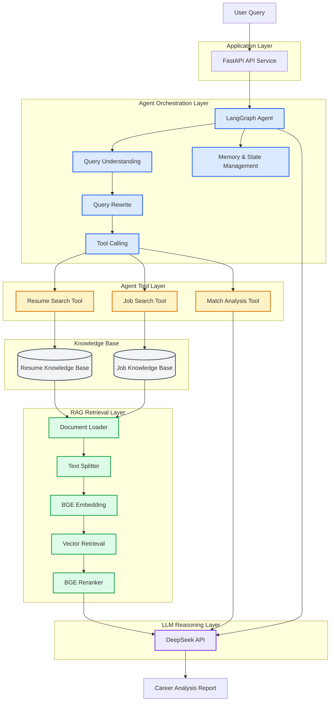

# AI-Agent-Resume-Matching-System Architecture

# 1. System Architecture

##2. Agent Workflow

用户输入：

User Query

↓

Query Understanding

↓

Query Rewrite

↓

Multi Query Retrieval

↓

Vector Database Search

↓

Document Retrieval

↓

BGE Reranker

↓

LangGraph Agent Reasoning

↓

Tool Calling

↓

LLM Generation

↓

Career Analysis Report

#3. Core Components
##3.1 Agent Layer

基于 LangGraph 构建 Agent 工作流。

主要能力：

LangGraph Agent Workflow
ReAct Agent Architecture
Tool Calling
Memory Checkpoint
State Management
##3.2 RAG Retrieval Layer

构建简历知识库和岗位知识库。

主要流程：

Document

↓

Loader

↓

Text Splitter

↓

Embedding

↓

Chroma Vector Database

↓

Retriever

↓

Reranker

↓

LLM

实现能力：

Resume Knowledge Base
Job Knowledge Base
Document Loading
Text Splitting
BGE Embedding
Chroma Vector Database
Similarity Retrieval
Query Rewrite
Multi Query Search
BGE Reranker
##3.3 Tool Layer

Agent 通过工具完成不同任务。

Resume Tool

负责：

简历信息检索
用户技能分析
项目经验提取
Job Search Tool

负责：

岗位信息检索
JD 分析
技能需求匹配
Match Tool

负责：

用户能力与岗位需求对比
岗位匹配度分析
职业建议生成
#4. LLM Layer

模型：

DeepSeek API

负责：

Agent 推理
信息整合
最终职业分析报告生成
#5. Data Layer
Resume Knowledge Base
Resume PDF

↓

PDF Loader

↓

Text Splitter

↓

Embedding Model

↓

Chroma Vector Database
Job Knowledge Base
Job Dataset

↓

Job Loader

↓

Text Processing

↓

Embedding Model

↓

Job Vector Database
#6. Technology Stack
Category	Technology
Programming Language	Python
Agent Framework	LangGraph
LLM Framework	LangChain
Vector Database	ChromaDB
Embedding	BGE Embedding
Reranker	BGE Reranker
API Framework	FastAPI
Data Validation	Pydantic
LLM API	DeepSeek
#7. Project Design Highlights
End-to-end Agent application development
RAG + Agent combination architecture
Vector retrieval optimization
Query rewriting strategy
Reranking improvement
Persistent Agent memory
Modular project architecture
#8. Future Improvements

计划继续优化：

Multi-Agent Collaboration
Long-term Memory System
Agent Evaluation Framework
LangSmith / Langfuse Observability
Production Deployment